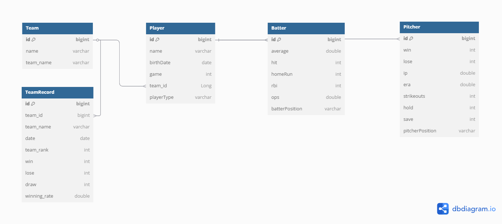
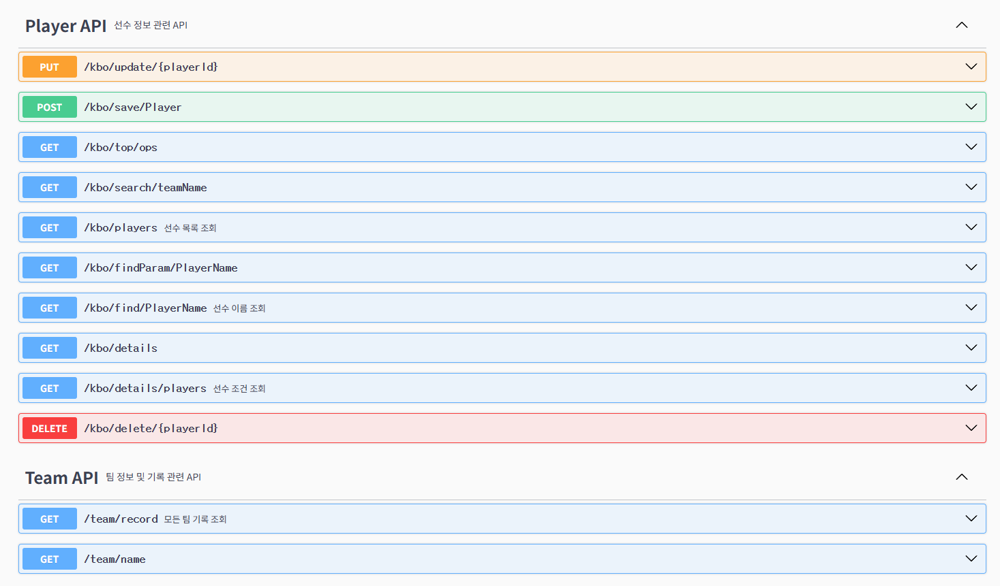

# 프로젝트 ERD 다이어그램


 

- `Team`과 `TeamRecord`는 1:N 관계로 설계되었으며, 하나의 팀이 여러 날의 기록을 가질 수 있도록 구조화되어 있습니다.
- 다만, 크롤링 및 저장 로직에서는 매일 수집된 팀 기록으로 기존 데이터를 전부 삭제 후 덮어쓰는 방식으로 동작합니다.  
  이는 **데이터 정합성과 최신성 유지에 중점을 둔 구조**로, 실제 DB에는 **가장 최신의 팀 기록만 저장**되며, 일별 히스토리는 보존되지 않습니다.  
  필요 시, 일별 이력 저장 기능도 쉽게 확장 가능하도록 설계되어 있습니다.

# ⚾ KBO 선수 검색 웹 애플리케이션

이 프로젝트는 KBO 리그의 선수 데이터를 크롤링하고, 이를 기반으로 사용자가 웹에서 다양한 조건으로 선수 정보를 검색할 수 있도록 구현한 웹 애플리케이션입니다.  
크롤링 → 데이터베이스 저장 → API 제공 → 웹 UI 구현 → 배포까지 전 과정을 직접 설계하고 구축했습니다.

---

## 📸 데모


---

## 🔧 기술 스택

| 구분      | 기술                                                     |
|---------|--------------------------------------------------------|
| 프론트엔드   | HTML5, CSS, JavaScript (Vanilla JS)                    |
| 백엔드     | Spring Boot 3.4.3, JPA, QueryDSL, Spring Security, JWT |
| DB      | MySQL, H2 (개발용)                                        |
| 크롤링     | Selenium (Java)                                        |
| API 문서화 | SpringDoc OpenAPI                                      |
| 배포      | AWS EC2, RDS, Docker                                   |

---

## 🧩 주요 기능

- ✅ 선수 이름 검색
- ✅ 팀별 필터
- ✅ 타자 / 투수 선택
- ✅ 세부 포지션 필터 (예: 중견수, 마무리투수 등)
- ✅ 규정 이닝(투수) 또는 경기 수 필터
- ✅ 선수 데이터 정렬 (이름, 타율, ERA 등)
- ✅ 타자/투수 자동 구분 후 컬럼 동적 생성
- ✅ 선수 데이터 수정, 삭제
- ✅ 선수 추가

---

## 🖥️ 실행 방법

### 1. MySQL 및 application-dev.properties 설정

> 이 파일은 **로컬 개발 환경에서만 사용되며**, Git에는 포함되지 않습니다.

예시: `src/main/resources/application-dev.properties`

```properties
spring.datasource.url=jdbc:mysql://localhost:3306/baseball
spring.datasource.username=your_username
spring.datasource.password=your_password
chrome.driver.path=C:/path/to/chromedriver.exe
server.port=8080

2. 프로젝트 빌드 ```bash ./gradlew build
3. 실행 java -jar build/libs/kbo-api.jar

## 📁 프로젝트 구조

Baseball/record/KBO
├── chrome                    # Selenium 크롤러 (타자, 투수, 팀 정보 수집)
├── config                    # 프로젝트 설정 (JWT, Swagger, Security 등)
├── controller                # REST API 컨트롤러
├── domain                    # 도메인 엔티티
├── dto                       # 요청/응답 DTO
├── repository                # JPA 레포지토리
├── service                   # 비즈니스 로직 서비스
└── KboApplication.java       # 메인 클래스

resources
├── static                    # 정적 리소스 (HTML)
└── application.properties    # 설정 파일

🔌 API 예시

- 선수 이름으로 검색
  'GET /kbo/find/PlayerName?name=노시환'
  **Response**
  ```json
  {
    "playerType": "BATTER",
    "average": 0.254,
    "hit": 51,
    "homeRun": 11,
    "rbi": 36,
    "ops": 0.799,
    "batterPosition": "THIRD",
    "name": "노시환",
    "birthDate": "2000-12-03",
    "game": 53,
    "teamName": "한화",
    "playerType": "BATTER"
  }

- 팀 이름으로 성적 조회
  'GET /team/record'
  **Response**
  ```json
   {
        "teamName": "LG",
        "date": "2025-05-28",
        "teamRank": 1,
        "game": 53,
        "win": 34,
        "lose": 18,
        "draw": 1,
        "winningRate": 0.654,
        "gamesBehind": 0.0
    },
    {
        "teamName": "한화",
        "date": "2025-05-28",
        "teamRank": 2,
        "game": 53,
        "win": 31,
        "lose": 22,
        "draw": 0,
        "winningRate": 0.585,
        "gamesBehind": 3.5
    },...
